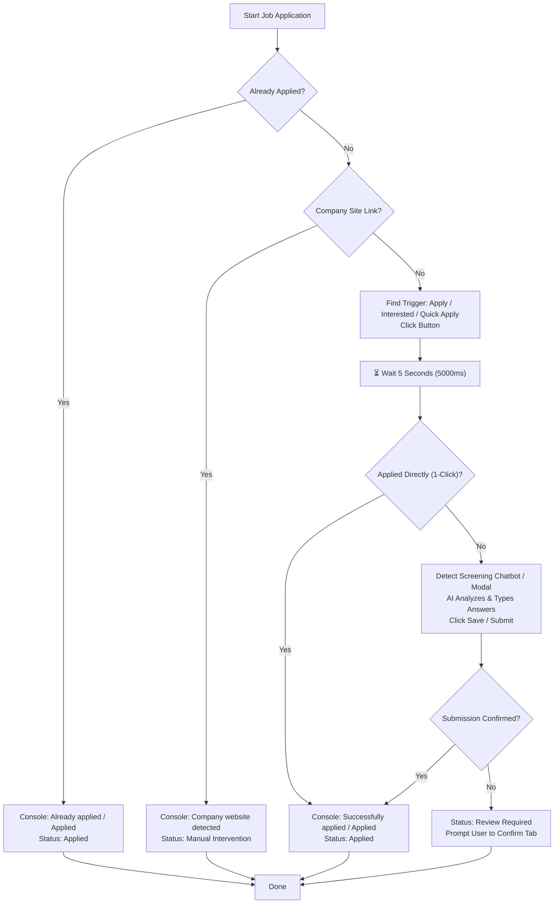

# 🤖 AI Job Application & Automation Specification (AI.md)

This document defines the core business logic, DOM automation rules, and AI screening workflows for **HireMind** across all execution engines (Chrome Extension & Local/Cloud Automation).

---

## 📌 Standard Operating Rules for Job Applications

### 1. Pre-Check: Already Applied Detection
Before attempting to apply, the system MUST inspect the page to determine if the candidate has already submitted an application.
* **Detection Triggers**:
  - Button text: `"Applied"`, `"Already Applied"`, `"Application Submitted"`
  - Page text: `"You have already applied"`, `"Applied on"`, `"Application sent"`
* **Action**:
  - Console Log: `console.log("[HireMind] Already applied")` & `console.log("[HireMind] Applied")`
  - Telemetry: Step `Already Applied` (100%)
  - Status: Update Application record to `Applied` with note `"Already applied on platform."`
  - Terminate flow cleanly without re-submitting.

---

### 2. Company Site Detection (Manual Intervention)
If the job listing redirects to an external company career website rather than supporting 1-click apply:
* **Detection Triggers**:
  - Button text / link text: `"Apply on company site"`, `"Apply on Company Site"`, `"Apply on Employer Website"`, `"Company Website"`
  - External URL redirects away from job board domain.
* **Action**:
  - Console Log: `console.log("[HireMind] Company website detected - Sending to Manual Intervention")`
  - Telemetry: Step `Company Website Detected` (100%)
  - Status: Move Application record to `Manual Intervention` queue with note `"Company website application - manual apply required."`
  - Terminate flow cleanly without attempting automated form submission.

---

### 3. Apply Trigger Keywords & Clicking
When locating the primary action button to apply for a job, inspect all visible candidate elements for the following trigger phrases:
* **Trigger Keywords**:
  - `"Apply"`
  - `"Apply Now"`
  - `"Quick Apply"`
  - `"Easy Apply"`
  - `"I am interested"`
  - `"I'm interested"`
  - `"Interested"`
  - `"Interested to apply"`
  - `"Express Apply"`
  - `"Direct Apply"`
  - `"Apply for job"`
* **Action**:
  - Dispatches natural human hover and click events.
  - Console Log: `console.log("[HireMind] Clicking Apply button: <button text>")`

---

### 4. Mandatory 5-Second Wait Rule
After clicking the Apply / Interested button:
* **Rule**: The system **MUST wait for 5 seconds (5000 ms)** to allow the page response, screening drawer, chatbot modal, or 1-click confirmation to fully render in the DOM.
* **Console Log**: `console.log("[HireMind] Waiting 5 seconds for page response / questions...")`

---

### 5. AI Screening Questionnaire & Chatbot Handling
If a screening modal, chatbot questionnaire drawer (e.g. Naukri Campus / Chatbot Drawer), or multi-step questionnaire appears:
* **AI Analysis**:
  - Extract the question text accurately.
  - Pass the question context to the AI engine (`/api/applications/qa/generate` or `/api/applications/{app_id}/answer`) along with candidate profile and parsed resume data.
* **Field Population**:
  - **Experience**: Fill with candidate experience years (e.g. `2 years`).
  - **Notice Period**: Fill with candidate notice period (e.g. `Immediate / 15 days`).
  - **Salary / CTC**: Fill with expected salary / negotiable note.
  - **Custom Questions**: Human-type AI-generated tailored answer.
  - **Radio / Options**: Select affirmative options (`"Yes"`, `"Authorized"`, `"Immediate"`, `"Full-time"`).
* **Advancement**:
  - Click `"Save"`, `"Send"`, `"Submit"`, or `"Next"` after each question turn.

---

### 6. Success Verification & Confirmation
Once the application form is completed and submitted:
* **Verification**:
  - Check that the page indicates success (`"Successfully Applied"`, `"Application Confirmed"`, or the apply button updates to `"Applied"`).
* **Action**:
  - Console Log:
    ```javascript
    console.log("[HireMind] Successfully applied");
    console.log("[HireMind] Applied");
    ```
  - Telemetry: Step `Applied` (100%)
  - Status: Update Application record to `Applied` with current timestamp.
  - Display user-facing success confirmation: `"Successfully Applied!"`

---

## 🔄 State Transition Flowchart


